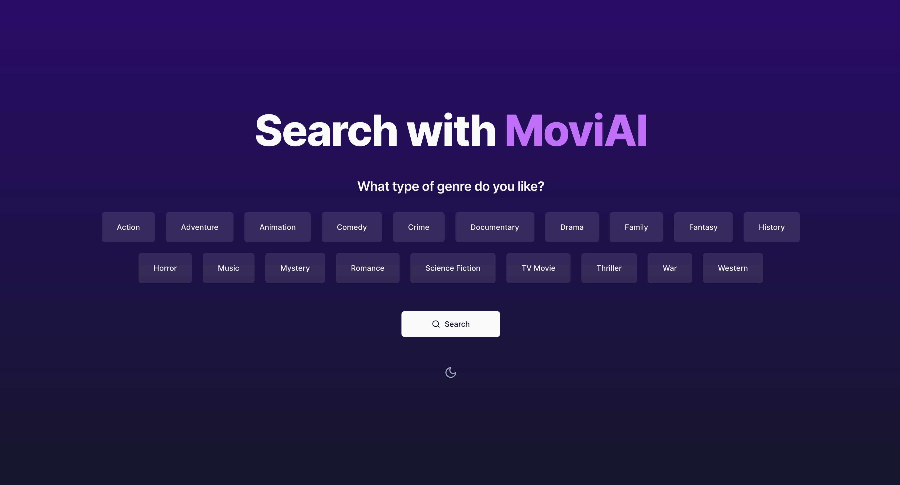
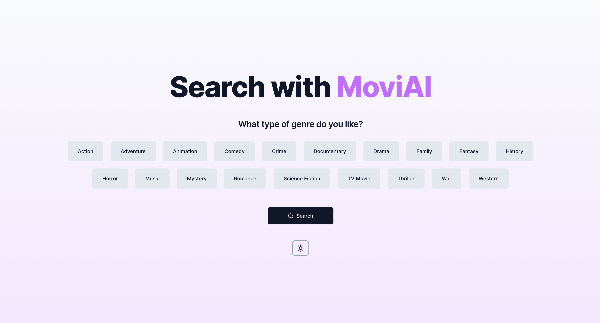

# MoviAI

<!--  -->
 


This is a movie recommendation website created in [Next.js 13](https://beta.nextjs.org/docs/getting-started) and [TailwindCSS](https://tailwindcss.com/). This project is created with `create-t3-app` and I used the AMAZING [shadcn/ui](https://ui.shadcn.com/) components library.

## What it does?

I give to the user the ability to search by genres and get the best 15 movies recommendations based on these genres. The recommendation is get from the new **gpt-3.5-turbo** from **openAI**. The user can also see the movie details, the people votes, etc..

## Try it out

#### You can try it out here: [moviAI](https://movi-ai.vercel.app/)
Or you can clone the repo and run it locally.

## How to run it locally

First, you need to clone the repo:

```bash
git clone https://github.com/salvaoo/moviAI.git
```

Go to the project directory:

```bash
cd moviAI
```

Then, you need to install the dependencies:

```bash
npm install
# or
yarn
```

Finally, you can run the project:

```bash
npm run dev
# or
yarn dev
```

Open [http://localhost:3000](http://localhost:3000) with your browser to see the result.


## License

[MIT](https://choosealicense.com/licenses/mit/)